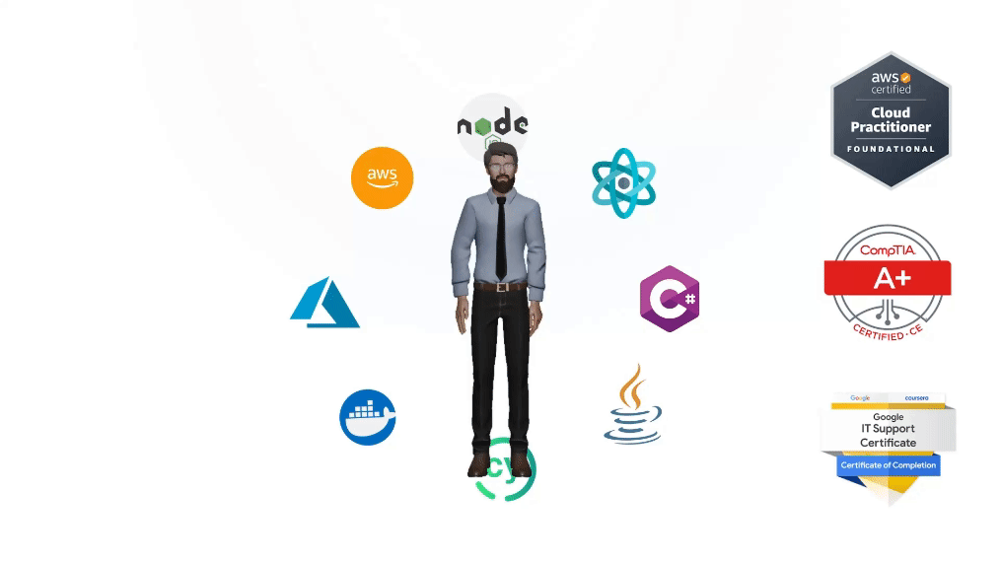

## Hola y bienvenido! 👋😁

- 🏋️‍♂️ I’m currently working on the PERN stack
- 🤓 I’m experimenting with Cloud/Testing/DevOps and how they relate to the entire SDLC
- 💥 I’m looking to collaborate on Game/Web/Mobile projects

- [AWS Cloud Practitioner](https://www.credly.com/badges/b9102805-939e-4a9f-b8e7-90e2433cae10/public_url)
- [COMPTIA A+ Certified](https://www.credly.com/badges/d0cfd15a-d1b9-490a-bfc4-bda2353941ba/public_url)
- [Google IT Support Certified](https://www.credly.com/badges/ef1595d5-c3ba-44fe-b6bd-e813022488ba/public_url)

<!--
**AnoshMalik/AnoshMalik** is a ✨ _special_ ✨ repository because its `README.md` (this file) appears on your GitHub profile.

Here are some ideas to get you started:

- 🔭 I’m currently working on ...
- 🌱 I’m currently learning ...
- 👯 I’m looking to collaborate on ...
- 🤔 I’m looking for help with ...
- 💬 Ask me about ...
- 📫 How to reach me: ...
- 😄 Pronouns: ...
- ⚡ Fun fact: ...
-->
